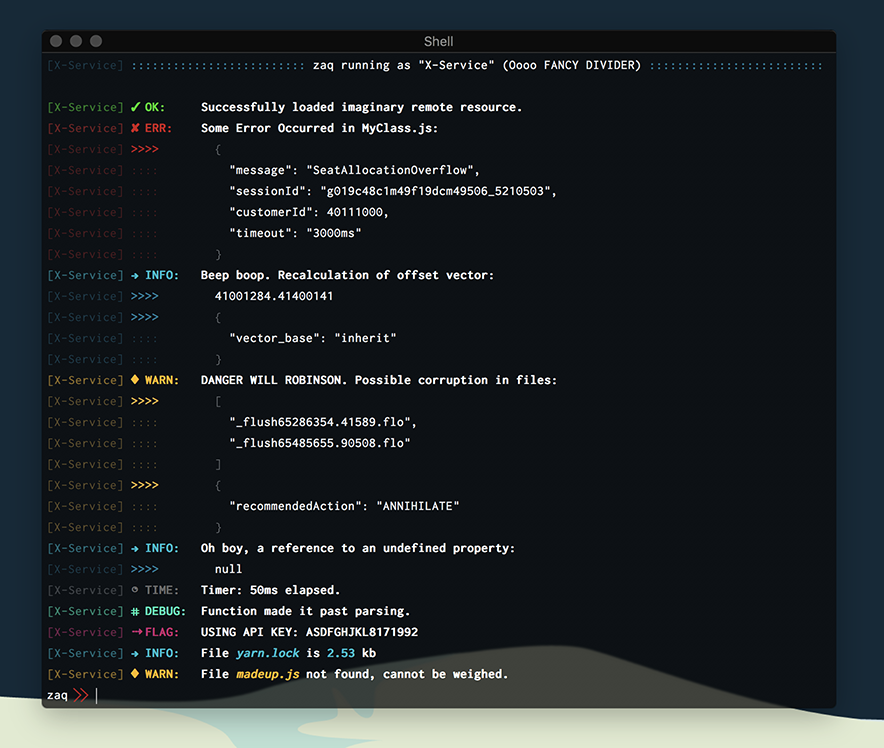
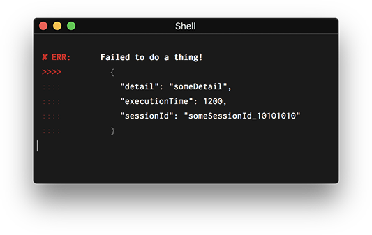
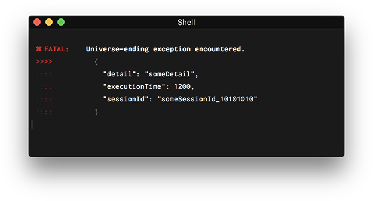
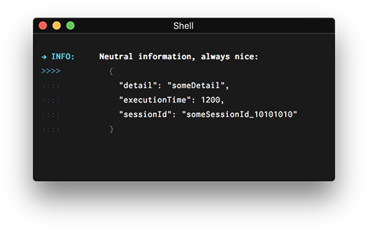
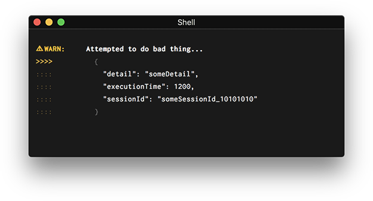
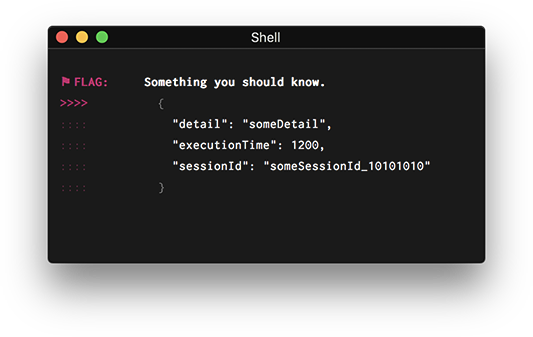
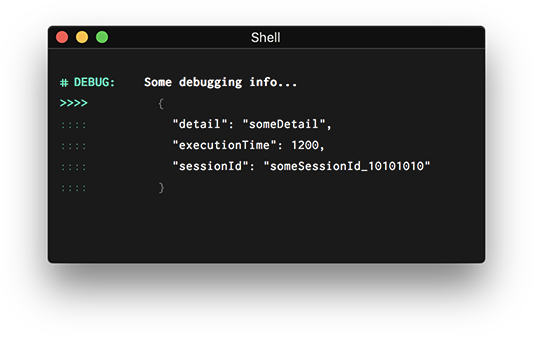
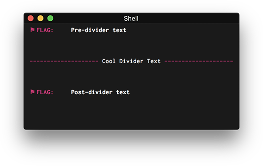
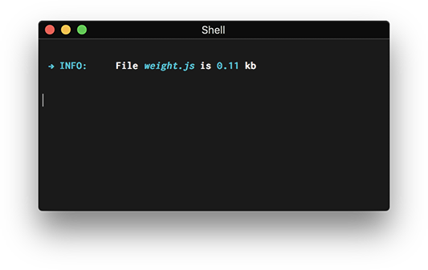
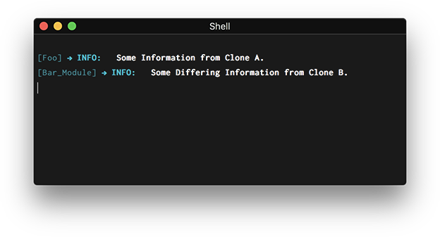

# `zaq`

Did we need another NodeJS logging utility? I dunno. Did we get one? *Yeah.*

Have you met `zaq`? He's all about practicality and style. What are you doing? *Shake his hand!*

Author: **Austin Billings**
License: **MIT**

# Installation
You know the drill. Install via NPM:
```
npm install zaq
```
(or Yarn, if you, too, are a hipster):
```
yarn add zaq
```
Then just `require` in your Node based project:
```js
const zaq = require('zaq');
```



---

### Basic Usage

- Namespaced logging is easy, using `zaq.as('MyNamespace')`. See `zaq.as()` details below.
- `zaq` logging functions are chainable, since each logging function returns its parent `zaq` instance.
- *Loggable objects* passed after the *message* are rendered in "pretty print" so you can easily visually grep for meaningful bits.  Pass as many objects as you want as additional arguments to any `zaq` logging function.


### Log Levels

|Level|Level Name|Methods At This Level|
|:---|:---|:---|
|0|`debug`|`zaq.debug`|
|1|`info`|`zaq.info`, `zaq.ok`, `zaq.flag`, `zaq.time`, `zaq.divider`|
|2|`warn`|`zaq.warn`|
|3|`error`|`zaq.err`|
|4|`fatal`|`zaq.fatal`|

---

### Logging Styles/Functions
Use the following `zaq` methods to log info from your app in more meaningful ways. Each logging "style" has an associated prefix, color, and logging level. In basic usage (i.e. purely logging to the transient console), logging level does not have any impact, but when you leverage `zaq.use()`, you can divert messages of specific levels to different recipients (resembling a simple messaging platform). More info on `zaq.use` can be found below.

## `zaq.ok(message[, ...loggables])`
Prints a message and any additional "loggable" values in the "OK" style, indicating successful operations.

**Color**: `green`

**Log Level**: `1: info`

**Example:**
```js
const zaq = require('zaq');

zaq.ok('Successfully completed task.', {
  detail: 'someDetail',
  executionTime: 1200,
  sessionId: 'someSessionId_10101010'
});
```


## `zaq.err(message[, ...loggables])`
Prints a message and any additional "loggable" values in the "ERR" style, indicating an error encountered.

**Color**: `red`

**Log Level**: `3: error`

**Example:**
```js
const zaq = require('zaq');

zaq.err('Failed to do a thing!', {
  detail: 'someDetail',
  executionTime: 1200,
  sessionId: 'someSessionId_10101010'
});
```


### `zaq.fatal(message[, ...loggables])`
Prints a message and any additional "loggable" values in the "FATAL" style, indicating a fatal exception. Similar to the `err` level, but with a higher log level severity (for potentially diverting messages to a developer's inbox, etc.).

**Color**: `red`

**Log Level**: `4: fatal`

**Example:**
```js
const zaq = require('zaq');

zaq.fatal('Universe-ending exception encountered.', {
  detail: 'someDetail',
  executionTime: 1200,
  sessionId: 'someSessionId_10101010'
});
```


## `zaq.info(message[, ...loggables])`
Prints a message and any additional "loggable" values in the "INFO" style, indicating situation-neutral general information.

**Color**: `blue`

**Log Level**: `1: info`

**Example:**
```js
const zaq = require('zaq');

zaq.info('Neutral information, always nice:', {
  detail: 'someDetail',
  executionTime: 1200,
  sessionId: 'someSessionId_10101010'
});
```


## `zaq.warn(message[, ...loggables])`
Prints a message and any additional "loggable" values in the "INFO" style, indicating situation-neutral general information.

**Color**: `yellow`

**Log Level**: `2: warn`

**Example:**
```js
const zaq = require('zaq');

zaq.warn('Attempted to do bad thing...:', {
  detail: 'someDetail',
  executionTime: 1200,
  sessionId: 'someSessionId_10101010'
});
```


## `zaq.flag(message[, ...loggables])`
Prints a message and any additional "loggable" values in the "FLAG" style, indicating neutral yet high-profile information.

**Color**: `magenta`

**Log Level**: `1: info`

**Example:**
```js
const zaq = require('zaq');

zaq.flag('Something you should know.', {
  detail: 'someDetail',
  executionTime: 1200,
  sessionId: 'someSessionId_10101010'
});
```


## `zaq.debug(message[, ...loggables])`
Prints a message and any additional "loggable" values in the "DEBUG" style, indicating potentially low-level developer-to-developer information for debugging purposes.

**Color**: `cyan`

**Log Level**: `0: debug`

**Example:**
```js
const zaq = require('zaq');

zaq.debug('Something you should know.', {
  detail: 'someDetail',
  executionTime: 1200,
  sessionId: 'someSessionId_10101010'
});
```


## `zaq.time(message[, ...loggables])`
Prints a message and any additional "loggable" values in the "TIME" style, indicating temporally-related information.

**Color**: `grey`

**Log Level**: `1: info`

**Example:**
```js
const zaq = require('zaq');

zaq.time('MyProcess consumed ' + some_duration + 'ms compute time', {
  start: some_start_time,
  end: some_end_time
});
```


---

# Other functionality

## `zaq.divider(dividerText[, options])`
Prints a "divider"-style line for better visual separation in your logs. Automatically fills the width of the present console process. Accepts several options:

|Option Key|Accepted Values|Default Value|Info|
|:---|:---|:---|:---|
|`centered`|`true` or `false`|`false`|"Centers" the divider text when `true`|
|`space`|Integers|0|Number of empty line-breaks to pad before and after the divider|
|`lineSymbol`|A String|`'-'`|Character to repeat to render the divider "line". Can be multiple characters or an empty space.|
|`lineColor`|A valid `chalk` color string.||Uses `chalk` to render the divider "line" in a given color.|


**Log Level**: `1: info`

**Example:**
```js
const zaq = require('zaq');

zaq
  .flag('Pre-divider text')
  .divider('Cool Divider Text', { lineColor: 'magenta', space: 1, centered: true })
  .flag('Post-divider text');
```



## `zaq.weight(filepath)`
Gets the 'weight' (size in KB) of the file at a given path. Logs the filesize using `zaq.info`.

**Color**: `blue`

**Log Level**: `1: info`

**Example:**
```js
const zaq = require('zaq');

zaq.weight('./weight.js');
```


# Usability

## `zaq.as(namespace)`
Returns a new instance of `zaq` wherein all log messages will be prefixed with the given `namespace` name. `namespace` can take the form of a string, number, or object (on which `toString` will be called for serialized identification, so be careful!).

`zaq` instances are managed globally. This means that you can say `const zaq = require('zaq').as('MyModule')` in two different files, but both `zaq` *references* will actually refer to the same *instance*.

**Example:**
```js
const fooZaq = require('zaq').as('Foo');
const barZaq = require('zaq').as('Bar_Module');

fooZaq.info('Some Information from Clone A.');
barZaq.info('Some Differing Information from Clone B.');
```



## `zaq.use(handlerConfig)`
Registers a message/log handler with `zaq`.

**Returns a numerical index which can be passed to `zaq.dispose()` afterward to remove/disable the handler.**

A `handlerConfig` looks like this:
```js
{
  handler: function someHandlerFunction (logMessage) {
    // logMessage is the complete "message" string, including
    // prefixes, namespaces, whitespace, and ASCII color
    // codes (unless { stripColors: true } is given)
    // e.g.,
    // "[Foo] → INFO:   Some Information from Clone A."
    doSomethingWith(logMessage);
  },
  options: {
    logLevel: 1,
    stripColors: true
  }
}
```

The following options are accepted. All options are optional.

|Option Key|Accepted Values|Default Value|Info|
|:---|:---|:---|:---|
|`logLevel`|Integers 0-4|0|Only log messages of the given level or higher are passed to the handler. For instance, a value of `1` will prevent the handler from ever receiving `debug`-level messages. See the table above for more information about log levels.
|`acceptLevels`|A single level string of an array of log level names.||When given, only messages with a log level contained in this array are passed to the handler. For example, `{ acceptLevels: 'debug' }` would allow the handler function to only receive `debug`-level messages. **Note: log messages must meet the criteria of both `acceptLevels` AND `logLevel` if both are provided.** (E.g., `{ logLevel: 3, acceptLevels: ['debug']}` will never handle any messages.)|
|`stripColors`|`true` or `false`|`false`|When `true`, all ASCII-based color codes are stripped from the output. Useful when writing log messages somewhere other than a standard terminal (like a plaintext file, for instance).|
|`timestamps`|`true` or `false`|`false`|When `true`, simple timestamps are prepended to logging messages. Especially useful when persisting logs to any sort of storage.

**Example:**
```js
const zaq = require('zaq').as('MyService');

// ( ... )

function persistentLoggerFn (logMessage) {
  addMessageToWriteBuffer(logMessage);
}

function fatalErrorHandler (fatalMessage) {
  dispatchMidnightEmail({
    to: 'sleepingDev@website.com',
    message: fatalMessage
  });
}

const persistentHandler = zaq.use(persistentLoggerFn, { timestamps: true, stripColors: true, logLevel: 1 });
const fatalHandler = zaq.use(fatalErrorHandler, { timestamps: true, stripColors: logLevel: 4 } );

// ( ... )

zaq.warn('User email duplicate detected.', { user });
// ^ This message is a warning (level 2), so it will hit "persistentLoggerFn",
//   which passes on the message to some disk write operation.

zaq.fatal('Failed to reconnect to DB Interface.', { dbResponse });
// ^ This message is a fatal error (level 4), so it will hit both "persistentLoggerFn"
//   AND  "fatalErrorHandler", which will send an email to our poor sleeping dev
//   with the message content like this (truncated):
//
//    3/16/2018 11:52:14 PM [MyService] ✖ FATAL:    Failed to reconnect to DB Interface.
//    3/16/2018 11:52:14 PM [MyService] >>>>          {
//    3/16/2018 11:52:14 PM [MyService] ::::            "dbResponse": [...]
//    ...
```

## `zaq.dispose(handlerIndex)`
Deletes the handler & options associated with the given **`handlerIndex`, which is originally given as the return value of `zaq.use`**.

**Example:**
```js
// --> continued from previous example
// ( ... )

if (siteIsNoLongerLive()) {
  zaq.dispose(fatalHandler);
}

// ( ... )

zaq.fatal('Oh no, the servers are on fire again.', request, { serverFireStats });
// ^ Since we disposed of the "fatalHandler" due to some site going offline,
//   this fatal error will be logged using "persistentLoggerFn", but will NOT
//   trigger a 3 AM email to our sleeping dev. Rejoice!

```
